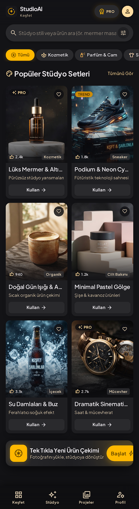
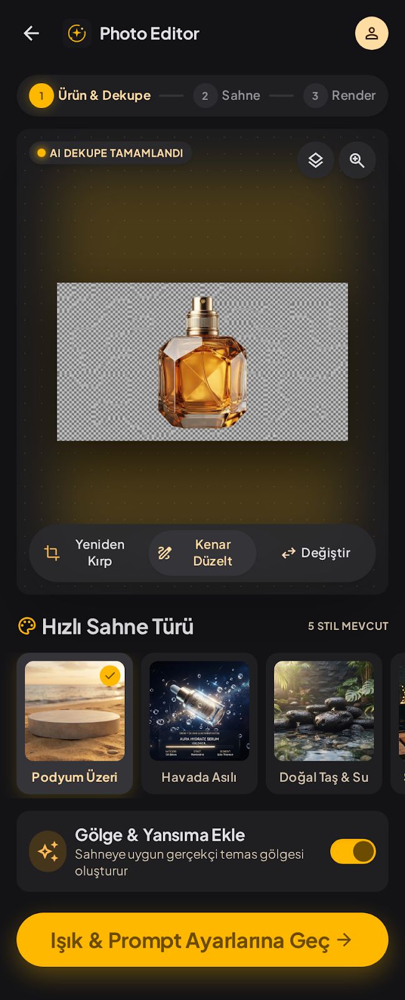
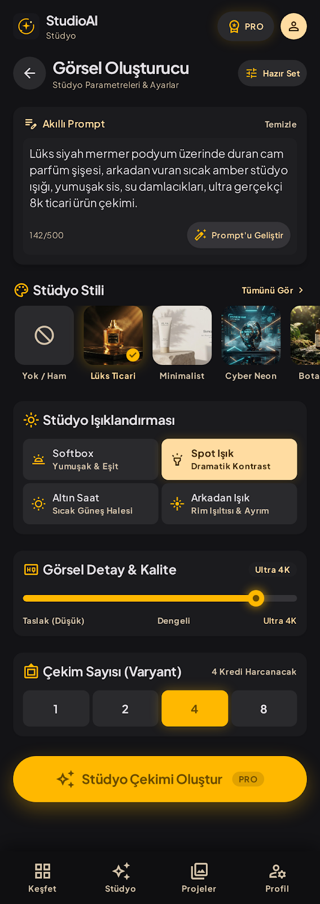
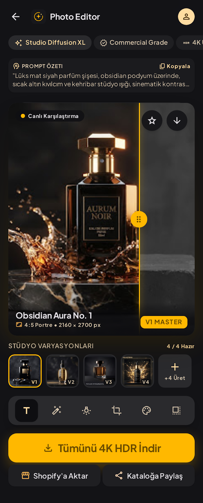

<div align="center">

# ✨ StudioAI

**Telefonla çekilmiş sıradan bir ürün fotoğrafını, saniyeler içinde profesyonel stüdyo çekimine dönüştüren yapay zekâ destekli mobil uygulama.**

Flutter mobil uygulama · Laravel API · Özel CSS admin panel · OpenRouter görsel modelleri


</div>

---

## 📸 Ekranlar

| Keşfet / Şablonlar | Ürün & Dekupe | Stüdyo Ayarları | Sonuçlar & Karşılaştırma |
|:---:|:---:|:---:|:---:|
|  |  |  |  |
| Hazır stüdyo setleri, kategori filtreleri, beğeni | AI arka plan temizleme, sahne türü, gölge/yansıma | Akıllı prompt, stil, ışık, kalite, varyant sayısı | Önce/sonra kaydırıcı, varyasyonlar, düzenleme araçları |

> Mobil ekranlar, `ekrantasarimlari/` klasöründeki tasarımlar ve **Obsidian Amber** tasarım sistemi (`ekrantasarimlari/obsidian_amber/DESIGN.md`) birebir referans alınarak kodlanmıştır.

---

## 🎯 Ne Yapar?

E-ticaret satıcıları ve küçük markalar ürünlerini stüdyoda çektirmek için ciddi zaman ve para harcar. StudioAI bu süreci telefona taşır:

1. **Fotoğrafı yükle** — kameradan ya da galeriden.
2. **AI Dekupe** — ürün arka plandan otomatik ayrılır.
3. **Sahneyi kur** — hızlı sahne türü, stüdyo stili, ışıklandırma, kalite ve varyant sayısını seç; istersen prompt'u yapay zekâya geliştirt.
4. **Render** — birden fazla ticari kalitede stüdyo görseli üretilir.
5. **Karşılaştır, düzenle, indir** — önce/sonra kaydırıcısıyla karşılaştır, rötuş / ışık yönü / en-boy oranı / renk sıcaklığı / 4K araçlarıyla düzenle, galeriye kaydet ya da paylaş.

**Temel ilke:** Ürünün kendisi (şekli, rengi, etiketi, logosu, yazıları) **değişmez** — yalnızca ortam, yüzey, ışık ve atmosfer değişir.

---

## ✨ Özellikler

### 📱 Mobil Uygulama (Flutter)
- **Keşfet:** Admin panelden yönetilen stüdyo şablonları, kategori çipleri, arama, beğeni, PRO/TREND rozetleri
- **Tek tıkla çekim:** Şablon seçildiğinde stil, ışık, sahne ve prompt otomatik dolar
- **AI Dekupe:** Yeniden kırp, kenar düzelt, fotoğrafı değiştir, orijinal/dekupe karşılaştırma
- **Stüdyo ayarları:** 500 karakterlik akıllı prompt + *Prompt'u Geliştir*, stil galerisi, 4 ışık ön ayarı, kalite kaydırıcısı, 1/2/4/8 varyant, anlık kredi hesabı
- **Sonuçlar:** Sürüklenebilir önce/sonra karşılaştırma, varyant galerisi, master seçimi, favori, **+4 Üret**
- **Düzenleme araçları:** Rötuş · Işık Yönü · En/Boy Oranı · Renk Sıcaklığı · 4K Yükseltme — her biri seçili varyanttan **yeni bir varyant** üretir, orijinal korunur
- **Dışa aktarma:** Tek tek ya da toplu galeriye kaydetme, sistem paylaşım menüsü
- **Projeler & Profil:** Geçmiş çekimler, kredi bakiyesi ve hareket geçmişi, PRO durumu

### 🛠️ Admin Panel (Blade + özel CSS, çerçevesiz)
- **Dashboard:** Kullanıcı, üretim, başarı oranı, günlük/aylık AI maliyeti, 30 günlük grafikler
- **Kullanıcılar:** Arama/filtre, kredi ekleme/düşme (defter kaydıyla), PRO üyelik atama, hesap engelleme
- **Üretimler:** Galeri görünümü, modele giden tam prompt, varyant detayları, tekrar deneme, kredi iadesi
- **Katalog:** Kategoriler, stüdyo stilleri, sahne türleri, ışık ön ayarları, kalite seviyeleri ve şablonlar için CRUD + prompt önizleme
- **Ayarlar:** OpenRouter API anahtarı (şifreli saklanır), sahte/canlı mod, model seçimi, sistem prompt'u, kredi ve limit ayarları, bakım modu, bağlantı testi
- **Loglar:** AI istek logları (süre, token, maliyet, hata), kredi hareketleri, başarısız kuyruk işleri
- **Roller:** Süper admin ve editör

### ⚙️ Backend (Laravel)
- Sanctum token tabanlı REST API (`/api/v1`)
- **Kredi defteri:** Her hareket kayıtlı; kilitli transaction'larla eşzamanlı güvenli; başarısız varyantta **otomatik iade**
- **Kuyruk:** Veritabanı sürücüsü (Redis gerekmez); her varyant ayrı iş, hata olursa tekrar deneme
- **Katmanlı prompt mimarisi:** sistem → sahne → stil → ışık → gölge → kalite → kullanıcı notu → oran → varyant kamera ipucu
- **Akıllı çözünürlük geri çekilmesi:** Model bir boyutu desteklemiyorsa 4K → 2K → 1K otomatik denenir ve öğrenilir
- **Sahte mod:** API anahtarı olmadan tüm akış test edilebilir, maliyet oluşmaz
- Günlük AI bütçe sınırı, rate limit, bakım modu, minimum uygulama sürümü

---

## 🏗️ Mimari

```
┌──────────────────┐   HTTPS / JSON (Bearer)    ┌──────────────────────────────────────────┐
│  Flutter App     │ ─────────────────────────► │  Laravel 12                               │
│  (Android / iOS) │ ◄──── durum sorgulama ──── │   ├─ /api/v1/*   Mobil REST API           │
└──────────────────┘                            │   ├─ /admin      Blade + özel CSS panel   │
                                                │   ├─ Jobs        Dekupe, Varyant üretimi  │
                                                │   └─ Services    OpenRouter, Prompt, Kredi│
                                                └──────────┬─────────────────────┬──────────┘
                                                           │                     │
                                                   ┌───────▼───────┐    ┌────────▼─────────┐
                                                   │ MySQL/MariaDB │    │  OpenRouter API  │
                                                   │ + jobs tablosu│    │ (görsel & metin) │
                                                   └───────────────┘    └──────────────────┘
```

**Üretim akışı:** Fotoğraf yüklenir → dekupe işi kuyruğa girer → kullanıcı ayarları seçer → kredi düşülür ve her varyant için ayrı iş başlatılır → görseller geldikçe mobil uygulama ekranı günceller → tüm varyantlar bitince başarısız olanların kredisi iade edilir.

---

## 🤖 Yapay Zekâ Modelleri

Tüm modeller [OpenRouter](https://openrouter.ai) üzerinden çağrılır ve **admin panelden tek tıkla değiştirilebilir**.

| Kullanım | Varsayılan model | Neden |
|---|---|---|
| Stüdyo çekimi + düzenleme araçları | `google/gemini-3.1-flash-lite-image` | Kaliteli modeller içinde en ekonomik (~0.03–0.04 $/görsel) |
| Dekupe | `google/gemini-3.1-flash-lite-image` | Aynı ekonomik model |
| Prompt'u Geliştir | `openai/gpt-5.4-nano` | Çok düşük maliyetli metin modeli |

Daha yüksek kalite için alternatifler: `google/gemini-3.1-flash-image` (4K destekli), `openai/gpt-5.4-image-2`. Bir kalite seviyesine (ör. yalnızca *Ultra 4K*) ayrı model de atanabilir.

---

## 🚀 Kurulum

> Docker **kullanılmaz**. Gerekenler: PHP 8.2+ (`pdo_mysql`, `gd`, `intl`, `zip`, `exif`, `fileinfo`), Composer 2, MySQL 8 veya MariaDB 10.4+ (XAMPP / Laragon yeterli), Node.js 20+, Flutter 3.x.

### 1. Backend

```bash
cd backend
composer install
cp .env.example .env
php artisan key:generate
```

`.env` içinde veritabanı bilgilerini düzenle ve `studioai` veritabanını oluştur (`utf8mb4_unicode_ci`):

```env
DB_CONNECTION=mysql
DB_DATABASE=studioai
DB_USERNAME=root
DB_PASSWORD=
```

Tabloları, örnek içeriği ve demo hesapları oluştur, ardından sunucu + kuyruk işçisini başlat:

```bash
php artisan migrate --seed
php artisan storage:link
composer run dev
```

`composer run dev`; API'yi `http://0.0.0.0:8000` üzerinde ve kuyruk dinleyicisini (`queue:listen`) birlikte çalıştırır.

### 2. Yapay zekâ bağlantısı

1. [openrouter.ai/keys](https://openrouter.ai/keys) adresinden bir API anahtarı oluştur.
2. `http://localhost:8000/admin` → **Ayarlar → Yapay Zekâ**
3. Anahtarı **OpenRouter API anahtarı** alanına yapıştır, **Sahte mod**'u kapat, kaydet.
4. **Bağlantıyı Test Et** ile anahtarı ve modelleri doğrula.

> Anahtar veritabanında `APP_KEY` ile **şifreli** saklanır ve panelde yalnızca maskeli gösterilir. Alternatif olarak `.env` içinde `OPENROUTER_API_KEY` tanımlanabilir. Anahtar yokken uygulama **sahte modda** çalışır: gerçek model çağrılmaz, örnek görseller üretilir.

### 3. Mobil uygulama

```bash
cd mobile
flutter pub get
```

**Android emülatör:**
```bash
flutter run --dart-define=API_BASE_URL=http://10.0.2.2:8000/api/v1
```

**USB ile bağlı gerçek Android cihaz** (güvenlik duvarı ayarı gerektirmez):
```bash
adb reverse tcp:8000 tcp:8000
flutter run --dart-define=API_BASE_URL=http://127.0.0.1:8000/api/v1
```

**Aynı Wi-Fi'daki cihaz:** `API_BASE_URL=http://<bilgisayarın-yerel-IP'si>:8000/api/v1`

### 4. Demo hesaplar

Seed ile oluşturulur — **yalnızca yerel geliştirme içindir**, canlıya çıkmadan önce değiştir.

| Nerede | E-posta | Şifre | Not |
|---|---|---|---|
| Mobil uygulama | `demo@studioai.test` | `password` | PRO üye, 100 kredi |
| Admin panel (`/admin`) | `admin@studioai.test` | `password` | Süper admin |

Uygulamadan yeni kayıt olan her kullanıcı **10 kredi** hoş geldin bonusu alır.

---

## 🔌 API Özeti

Taban adres: `/api/v1` · Kimlik doğrulama: `Authorization: Bearer <token>`

| Metot | Uç nokta | Açıklama |
|---|---|---|
| `POST` | `/auth/register` · `/auth/login` · `/auth/logout` | Kimlik |
| `GET` | `/me` · `/me/credit-transactions` | Kullanıcı, bakiye, kredi geçmişi |
| `GET` | `/app/config` · `/catalog` | Uygulama ayarları; stil, sahne, ışık, kalite listeleri |
| `GET` / `POST` | `/templates` · `/templates/{id}/like` | Şablonlar ve beğeni |
| `POST` | `/projects` | Fotoğraf yükle (multipart) → dekupe başlar |
| `GET` / `PATCH` | `/projects/{id}` | Proje durumu, sahne/gölge seçimi |
| `POST` | `/projects/{id}/cutout` · `/projects/{id}/image` | Dekupeyi yenile · fotoğrafı değiştir |
| `POST` | `/prompt/enhance` | Prompt'u yapay zekâyla geliştir |
| `POST` | `/projects/{id}/generations` | Stüdyo çekimi başlat |
| `GET` | `/generations/{id}` | Üretim durumu ve varyantlar (sorgulama) |
| `POST` | `/generations/{id}/more` | Aynı ayarlarla ek varyant |
| `POST` | `/generation-images/{id}/edit` | Düzenleme aracı (`retouch`, `light`, `ratio`, `color`, `upscale`) |
| `PATCH` / `GET` | `/generation-images/{id}` · `/download` | Favori/master · tam çözünürlük indirme |

Hatalar tek biçimde döner: `{ "message": "...", "code": "INSUFFICIENT_CREDITS", "errors": {} }`

---

## 📁 Proje Yapısı

```
.
├── PROJE_DOKUMANI.md          # Ayrıntılı teknik doküman (veritabanı, API, prompt mimarisi, yol haritası)
├── ekrantasarimlari/          # Ekran tasarımları (PNG + HTML) ve Obsidian Amber tasarım sistemi
├── backend/                   # Laravel 12 — API + admin panel
│   ├── app/
│   │   ├── Actions/           # StartGeneration, FinalizeGeneration
│   │   ├── Http/Controllers/  # Api/V1 (mobil) · Admin (panel)
│   │   ├── Jobs/              # CutoutJob, GenerateVariantJob
│   │   ├── Services/          # Ai (OpenRouter, sahte istemci, PromptBuilder), Credits, ImageStorage
│   │   └── Support/           # AiConfig, EditTools, Media
│   ├── database/              # Migration'lar ve seed (tasarımdaki içerik)
│   ├── public/panel-assets/   # Admin paneli CSS/JS
│   ├── resources/views/admin/ # Admin Blade şablonları
│   └── tests/Feature/         # API, admin panel ve OpenRouter istemci testleri
└── mobile/                    # Flutter uygulaması
    └── lib/
        ├── core/              # Tema (Obsidian Amber), ağ katmanı, router, ortak bileşenler
        ├── data/              # Modeller ve API deposu
        └── features/          # auth · discover · studio · results · projects · profile
```

---

## 🧪 Testler

```bash
cd backend
php artisan test
```

Testler; kimlik doğrulama, uçtan uca üretim akışı, kredi düşme/iade, PRO kısıtları, yetkisiz erişim, düzenleme araçları, admin sayfaları, şifreli API anahtarı ve OpenRouter hata/geri çekilme senaryolarını kapsar. Testlerde gerçek API'ye **istek atılmaz** (sahte mod + `Http::fake`).

```bash
cd mobile
flutter analyze
```

---

## 🔒 Güvenlik Notları

- `.env`, API anahtarları, kullanıcı yüklemeleri ve üretilen görseller **depoya dahil edilmez** (`.gitignore`).
- OpenRouter anahtarı yalnızca sunucuda tutulur; mobil uygulama OpenRouter'a asla doğrudan bağlanmaz.
- Admin panelden girilen anahtar `APP_KEY` ile şifrelenir; `APP_KEY` değişirse anahtarı yeniden girmek gerekir.
- Kullanıcılar yalnızca kendi proje ve üretimlerine erişebilir; giriş, üretim ve prompt geliştirme uç noktalarında rate limit vardır.
- Canlı ortamda demo hesapların şifrelerini değiştir, `APP_DEBUG=false` yap ve HTTPS kullan.

---

## 🗺️ Yol Haritası

- [x] Tasarımlara birebir mobil ekranlar, dekupe, çoklu varyant üretimi
- [x] Kredi sistemi, otomatik iade, PRO kısıtları
- [x] Özel CSS admin panel, katalog yönetimi, maliyet takibi
- [x] Sonuç ekranı düzenleme araçları
- [ ] Giriş, Projeler ve Profil ekranlarının final tasarımları
- [ ] Cihaz üzerinde gerçek şeffaf dekupe
- [ ] Push bildirimi (üretim tamamlandı)
- [ ] Uygulama içi satın alma (kredi paketleri, PRO abonelik)
- [ ] Shopify'a aktarım

Ayrıntılar için: **[PROJE_DOKUMANI.md](PROJE_DOKUMANI.md)**
